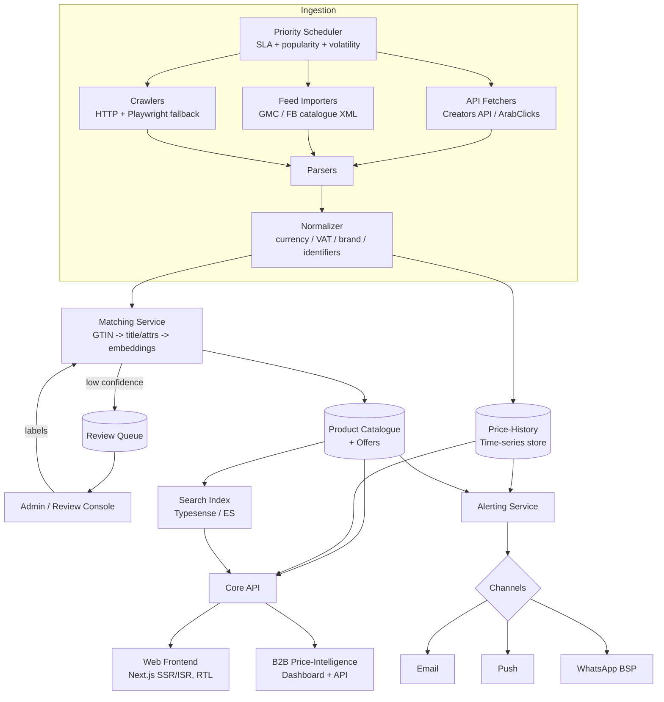

# Product Plan — GCC Price Comparison Platform

**Working codename:** *SuqCompare* (placeholder — see Open Questions)
**Document owner:** Founder
**Date:** 2026-06-12
**Status:** Draft v1 — for validation and fundraising/build decisions

> A price-comparison and price-history platform for the Gulf. Launch UAE-first (electronics + home appliances), expand to KSA and the rest of the GCC, then architect for worldwide. Think Pricena/idealo/PriceRunner for the Gulf — but with fresher prices, near-zero false product matches, Arabic-first UX, and price-history transparency as the hook.

---

## 1. Executive summary

**The product.** A consumer-facing website (mobile-first responsive, native apps later) where a shopper searches for a product once and sees every UAE store's current price, shipping cost, availability, and — critically — the **price history** of that exact product, plus the ability to set a **price-drop alert** delivered by email, push, or WhatsApp. Behind it sits a data pipeline that ingests prices from retailers (affiliate APIs, merchant feeds, and compliant crawling) and a product-matching engine that guarantees the laptop you see at Sharaf DG is the *same SKU* as the one at Amazon.ae.

**The wedge.** The incumbents (Pricena, kanbkam) exist and are active, which proves demand — but they leave clear gaps: stale prices, visibly imperfect product matching, weak Arabic-first UX, thin grocery/daily-essentials coverage, and inconsistent price-history transparency. We win on **trust** (correct matches + fresh prices + honest history) and **Arabic-first** design rather than on breadth at launch.

**Why now.**
- UAE e-commerce is large and compounding — roughly **US$8–13B** depending on the source/year (see §2), inside a GCC e-commerce market valued in the hundreds of billions and growing **~15% CAGR** ([IMARC](https://www.imarcgroup.com/gcc-e-commerce-market)).
- Amazon's **PA-API is being deprecated (15 May 2026) in favour of the Creators API** ([Amazon](https://webservices.amazon.com/paapi5/documentation/register-for-pa-api.html)) — a migration moment that levels the field; whoever builds clean ingestion on the new primitives starts even with incumbents.
- Affiliate infrastructure for the region is mature (ArabClicks, Admitad, direct retailer programs) so monetisation is wired from day one.
- AI embeddings have made high-precision product matching cheap enough for a solo founder to deploy — the single hardest part of this business is now tractable.

**Why UAE-first.** Highest e-commerce penetration and ARPU in the region, English+Arabic bilingual baseline, dense set of online retailers with affiliate programs (Amazon.ae, Noon, Sharaf DG, Carrefour, Lulu), a compact geography that simplifies shipping/availability modelling, and a regulatory environment (UAE PDPL, free zones) that is workable for a lean entity. UAE is the proving ground; KSA is the prize (largest GCC consumer market), and the platform is built so that *adding a country is configuration, not re-architecture.*

---

## 2. Market analysis

### 2.1 Market size (cite-aware; figures vary by source/methodology)

| Metric | Figure | Source (year) |
|---|---|---|
| UAE e-commerce (2024 actual) | AED 32.3B (~US$8.8B) | [EZDubai report, via market press](https://www.adat.ae/guides/uae-ecommerce-statistics) |
| UAE e-commerce (2025–26 est.) | ~US$12.3B | [CortexDM compilation](https://www.cortexdm.com/blog/uae-e-commerce-market-forecast-2025-2026-uae-ecommerce-market-stats) |
| UAE e-commerce (2030 forecast) | ~US$21.2B, ~11.5% CAGR | [Mordor Intelligence](https://www.mordorintelligence.com/industry-reports/united-arab-emirates-ecommerce-market) |
| GCC e-commerce (2025) | ~US$585B (broad definition) | [IMARC](https://www.imarcgroup.com/gcc-e-commerce-market) |
| GCC e-commerce CAGR (2026–34) | ~15.1% | [IMARC](https://www.imarcgroup.com/gcc-e-commerce-market) |

> **Assumption note:** estimates differ widely because some count B2C retail only and others include B2B/marketplaces. For planning, treat **UAE B2C retail e-commerce ≈ US$9–13B in 2025–26** and **growing low-double-digit % per year** as the working range. Our addressable slice is the *consideration* layer above this — shoppers comparing before buying — which is a multiple of the transaction value in terms of sessions.

### 2.2 Retailer matrix (priority markets)

| Retailer | UAE | KSA | Kuwait | Qatar | Bahrain | Oman | Category strength | Affiliate access |
|---|---|---|---|---|---|---|---|---|
| Amazon (.ae/.sa) | ✅ | ✅ | — | — | — | — | Broad / electronics | PA-API → **Creators API** (10 sales/30d gate) |
| Noon | ✅ | ✅ | — | — | — | — | Broad / electronics / FMCG | ArabClicks, Admitad (5–20%) |
| Sharaf DG | ✅ | — | — | — | ✅ | — | Electronics, appliances | ArabClicks direct program |
| Jarir | — | ✅ | — | ✅ | — | — | Electronics, books, office | Feed/affiliate (verify) |
| eXtra | — | ✅ | — | — | ✅ | — | Electronics, appliances | Affiliate (verify) |
| Xcite (Alghanim) | — | — | ✅ | — | — | — | Electronics | Affiliate (verify) |
| Carrefour (MAF) | ✅ | ✅ | ✅ | ✅ | ✅ | ✅ | Grocery + electronics | Affiliate / partnership |
| Lulu | ✅ | ✅ | ✅ | ✅ | ✅ | ✅ | Grocery + electronics | Partnership (verify) |
| Namshi / SHEIN | ✅ | ✅ | ✅ | ✅ | ✅ | ✅ | Fashion | ArabClicks |

✅ = strong online presence; "verify" = affiliate program existence/terms to confirm during Phase 0. Sources: [ArabClicks advertiser explorer](https://www.arabclicks.com/advertisers/advertisers-explorer/), [Sharaf DG via ArabClicks](https://www.arabclicks.com/advertisers/sharaf-dg-affiliate-program/).

### 2.3 Competitor analysis

| Competitor | Coverage | Strengths | Weaknesses / gaps we exploit |
|---|---|---|---|
| **Pricena** (ae.pricena.com) | UAE, KSA, Egypt, Kuwait, Qatar; electronics-led + fashion | #1 brand recognition in MENA; price history; large store list; native apps | Price *freshness* inconsistent; product-matching errors visible on long-tail SKUs; English-leaning UX; grocery/daily-essentials thin; UX feels dated |
| **kanbkam** (kanbkam.com) | KSA/UAE/EG; electronics **+ a working grocery vertical** (`supermarket.kanbkam.com`) | Strong on price *history* and price *drops*; already has supermarket comparison (Tamimi, Panda, Othaim, Lulu, Carrefour) | UX/SEO weaker than Pricena; matching/coverage gaps; brand awareness low; not Arabic-first |
| **Global players** (idealo, PriceRunner/Klarna, Google Shopping) | Not localized to GCC | Mature tech & matching | No GCC retailer coverage, no Arabic, no local shipping/VAT modelling — effectively absent here |
| **Retailer-native / offer aggregators** (ClicFlyer, OffersInMe) | Leaflet/offer scans | Catalogue/leaflet coverage | Not true per-SKU price comparison; no history; no alerts |

**The exploitable gaps, ranked:**
1. **Price freshness.** Incumbents often show prices hours-to-days stale. We treat freshness as a product feature with a visible "price checked X ago" timestamp and per-category SLAs (§5.4).
2. **Product-matching quality.** Wrong matches (different storage tier, region variant, bundle vs unit) are the cardinal sin. We target **>99% precision on published matches** and route ambiguity to a review queue (§6).
3. **Arabic-first UX.** Incumbents bolt Arabic on. We design RTL-first with bilingual product titles (§9).
4. **Grocery / daily essentials.** kanbkam has a head start here but it's under-loved. Grocery drives weekly habit, not just considered-purchase visits. (V2.)
5. **Price-history transparency.** Make the chart the hero so "is this White Friday deal real?" is answered instantly — directly countering fake-discount fatigue.

---

## 3. Target users & personas

**P1 — Maria, the expat bargain hunter (UAE).** 32, marketing manager in Dubai, shops online weekly, price-sensitive on electronics and appliances, follows deal Telegram groups. *Needs:* "is this actually a deal or a fake markdown?" *Wins with:* price history chart + drop alerts via WhatsApp. Primary MVP persona.

**P2 — Faisal, the KSA electronics buyer.** 27, Riyadh, researches heavily before a high-ticket purchase (phone, console, TV), Arabic-first, compares Jarir vs eXtra vs Amazon.sa vs Noon. *Needs:* trustworthy same-SKU comparison in Arabic with local availability. *Wins with:* exact-match comparison + Arabic-first UX. Phase-2 anchor persona.

**P3 — Ravi, the deal-community power user.** 24, runs/curates a UAE deals Telegram channel, wants an API/feed of verified price drops to share. *Needs:* clean, fast, embeddable drop data and referral links. *Wins with:* premium tier (instant alerts, API) and becomes a distribution partner (§11).

**P4 — Dana, the B2B retail/category analyst.** Works at a mid-size electronics retailer; needs competitor price intelligence (where am I over/underpriced, by SKU, daily). *Needs:* dashboard + export/API of competitor pricing. *Wins with:* B2B price-intelligence product (§7) — the highest-margin revenue line.

---

## 4. Product scope

### 4.1 MVP — UAE, electronics + home appliances

- **Product search** (bilingual, typo-tolerant, brand/model aware).
- **Comparison page** per product: each store's **price, shipping cost, total landed price, availability**, with a clear CTA (affiliate-linked) to the store.
- **Price-history charts** per product (the hero element).
- **Price-drop alerts**: email + web/mobile push + **WhatsApp** (region-critical channel).
- **English + Arabic with full RTL from day one.**
- **Mobile-first responsive web** (no native apps yet).
- Coverage target at launch: a defensible **catalogue of high-intent electronics/appliance SKUs** across Amazon.ae, Noon, Sharaf DG, Carrefour UAE, Lulu (+ others as feeds land), with matching precision prioritised over raw SKU count.

**Explicitly out of MVP:** native apps, grocery, coupons, browser extension, multi-country.

### 4.2 V2

- More categories: **beauty, baby, then grocery/daily-essentials** (grocery is the weekly-habit unlock).
- **Barcode scanning** (in-store price check).
- **Browser extension** (compare while on a retailer page).
- **Coupon/voucher aggregation** (works with affiliate economics).
- **Native iOS/Android apps.**

### 4.3 Future (worldwide-ready)

- Country/market is a first-class data dimension from day one (§8), so new GCC markets are config. Worldwide expansion considerations: per-market retailer connectors, currency/VAT/tax rules, language packs, legal posture per jurisdiction, and a decision on whether to license a global product catalogue (GS1/GTIN) to bootstrap matching.

---

## 5. Data acquisition strategy *(make-or-break)*

The defensibility of this business is **data: complete, fresh, correctly-matched.** We acquire it in three tiers, preferring the cheapest/most-stable source per retailer and falling back as needed.

### 5.1 Tier 1 — Affiliate / product APIs (preferred)

| Source | Mechanism | Notes / risks |
|---|---|---|
| **Amazon.ae/.sa** | PA-API 5.0 → **Creators API** (PA-API deprecates **15 May 2026**) | Eligibility gate: **10 qualified sales in trailing 30 days** to keep API access ([Amazon](https://affiliate-program.amazon.com/help/node/topic/GVJ2BJP35457CLML)). AE marketplace sits in the EU region. **Risk:** access can be revoked; throttled call limits scale with sales. Mitigation in §14. |
| **Noon** | Affiliate networks: **ArabClicks**, **Admitad** | Deep-link + (where offered) product/offer feeds; commissions 5–20% ([ArabClicks](https://www.arabclicks.com/advertisers/noon-affiliate-program/)). |
| **Sharaf DG, eXtra, Jarir, Xcite** | Direct affiliate programs / network feeds | Many expose product feeds (CSV/XML) to affiliates — request feed access on signup. |
| **Carrefour / Lulu** | Partnership or affiliate feed | Grocery feeds are the highest-value, hardest-to-get; pursue via partnership (Tier 2). |

**Principle:** every Tier-1 connector returns the affiliate-trackable deep link *and* the price/availability, so monetisation and data ingestion are the same call.

### 5.2 Tier 2 — Direct merchant partnerships

The pitch to retailers: **"We send you ready-to-buy traffic for free; you give us a clean product feed."** A price comparison listing is high-intent inbound. Offer:
- Free inclusion + a **"featured store"** upgrade (paid, §7).
- A simple **feed spec**: `gtin/ean`, `mpn/model`, `brand`, `title_en`, `title_ar`, `price`, `currency`, `vat_inclusive (bool)`, `shipping_cost`, `availability`, `product_url`, `image_url`, `updated_at`. Accept Google Merchant Center / Facebook catalogue XML to minimise retailer effort (most already produce these).
- For B2B-curious retailers, partnership conversations seed the **price-intelligence** upsell (§7).

### 5.3 Tier 3 — Compliant web scraping (fallback only)

Used when no feed/API exists. Treated as a managed-risk operation, not a default.

- **ToS / robots.txt:** review each retailer's `robots.txt` and ToS before crawling; honour disallow rules and crawl-delay. Public price data is generally factual, but *contractual* ToS and *technical* anti-bot measures both matter. Where ToS forbids automated access, prefer feed/partnership or a **licensed third-party data provider** instead of crawling.
- **Rate limiting & politeness:** conservative per-host concurrency, randomized jitter, off-peak scheduling, identifiable user-agent + contact, exponential backoff on 4xx/5xx.
- **Rendering needs:** prefer raw HTML/JSON endpoints; reach for headless rendering (Playwright) only when a site is JS-rendered. Headless is 5–20× more expensive per page — budget accordingly.
- **Anti-bot reality:** Cloudflare/Akamai/DataDome are common. Rather than entering an arms race (rotating residential proxies, CAPTCHA solving), **switch that retailer to a third-party data provider or a feed deal.** A solo founder should not be the world's most determined scraper.
- **When to buy instead of scrape:** if a retailer is (a) anti-bot-hardened, (b) ToS-hostile, or (c) high-value-but-low-coverage, license data from a commerce-data vendor (e.g. regional feed aggregators / global product-data providers). Buy stability; spend engineering on matching, not on evading WAFs.

### 5.4 Freshness SLAs per category

| Category | Target max price age (SLA) | Crawl/refresh cadence |
|---|---|---|
| Electronics / appliances (high-ticket, volatile) | ≤ 3 hours | Hot SKUs every 1–3h; long tail daily |
| Fashion / beauty | ≤ 12 hours | 2×/day |
| Grocery / daily essentials | ≤ 24 hours | Daily (overnight) |
| Discontinued / out-of-stock | best-effort | Daily existence check |

**How the scheduler honours SLAs:** each `(product, store)` offer carries a `priority_tier` and `last_fetched_at`. A **priority scheduler** computes a refresh-due score from (SLA budget − age) × popularity × volatility, and enqueues fetch jobs accordingly. Popular and price-volatile SKUs jump the queue; cold SKUs decay to daily. The displayed "checked X ago" timestamp is the SLA made visible to the user — and a forcing function on us.

---

## 6. Product matching engine *(the technical moat)*

Wrong matches destroy trust faster than missing coverage. **Target: >99% precision on published matches** (we would rather *not publish* an offer than publish a wrong one). Recall is improved over time via the review queue.

**Matching cascade (high → low confidence):**

1. **Exact identifier match.** If two offers share a valid **GTIN/EAN/UPC** or normalized **MPN/model number**, they are the same product. This is the gold path; we aggressively harvest identifiers from feeds (feeds usually carry GTIN).
2. **Normalized title + attribute extraction.** Parse brand, model, variant attributes (storage 128/256GB, colour, region variant, size), units. Normalize (Arabic↔English brand spellings, transliteration). Block on brand+model, then score attribute overlap.
3. **Embedding similarity.** For remaining candidates, compute multilingual text (and optionally image) embeddings; nearest-neighbour within the brand/category block. High similarity → auto-match; mid similarity → review queue.
4. **Human-in-the-loop review queue.** Low-confidence pairs surface in the admin console (§8) for a one-click confirm/reject. Decisions become labelled training data that tunes thresholds. This is how a solo founder scales precision without scaling headcount linearly.

**Guardrails:**
- Variant discipline: 128GB ≠ 256GB; "international" ≠ "Middle East" warranty variant; single unit ≠ multipack. Encode these as hard blockers.
- Confidence stored per match; only `≥ auto_publish_threshold` is shown to users.
- Continuous precision sampling: a daily audit samples published matches for manual QA; precision is a tracked KPI (§13).

---

## 7. Monetization

| Stream | Model | When | GCC reality |
|---|---|---|---|
| **Affiliate (CPA/CPC)** | Commission on referred sales | Day 1 | Electronics ~1–5% CPA typical; broader retail/fashion 5–20% via ArabClicks/Admitad ([ArabClicks](https://www.arabclicks.com/advertisers/noon-affiliate-program/)). Primary early revenue. |
| **Featured store placement** | Paid priority slot on comparison page (labelled) | After traffic | Must be clearly disclosed; never reorder the *cheapest* result deceptively. |
| **Display ads** | Programmatic / direct | Only after meaningful traffic | Low priority; protects UX until scale. |
| **B2B price-intelligence** | SaaS dashboard + API for retailers/brands | Phase 2 | **Highest margin.** Competitor pricing by SKU, price-position alerts, history exports. We already collect this data; productising it is near-pure margin. |
| **Premium user tier** | Subscription | V2 | Instant (not batched) alerts, more watchlists, API access, ad-free. |

**Revenue ramp logic (directional, not fabricated precise numbers):**
- **Phase 1:** affiliate only. Revenue ≈ `monthly_outbound_clicks × CTR-to-buy × AOV × commission%`. With a small but high-intent audience, electronics' high AOV (phones, TVs, appliances) means even modest click volume produces real revenue per click. Focus is *coverage + trust*, not yet revenue.
- **Phase 2:** add **B2B price-intelligence** (a handful of retailer/brand contracts can exceed all affiliate revenue combined) and featured placement.
- **Phase 3:** premium subscriptions + ads as traffic compounds via SEO. Affiliate remains the floor; B2B and premium are the margin.

---

## 8. Technical architecture

### 8.1 Components

- **Scheduler** — priority queue honouring per-category freshness SLAs (§5.4).
- **Fetchers** — per-source connectors: API clients (Creators API, ArabClicks deep-link/feeds), feed importers (Google/FB catalogue XML), and crawlers (HTTP + headless Playwright fallback). Proxy/anti-bot concerns isolated here.
- **Parsers** — source-specific extraction → a canonical raw offer record.
- **Normalizer** — currency, VAT flag, units, brand/title normalization (EN/AR), identifier extraction.
- **Matching service** — the cascade in §6; writes `product_id ↔ offer` links with confidence.
- **Search** — **Typesense** (lean, typo-tolerant, fast to operate solo) or Elasticsearch/OpenSearch at scale; bilingual analyzers (Arabic + English).
- **Price-history store** — time-series of `(offer_id, price, currency, ts)`; TimescaleDB/Postgres hypertable or ClickHouse for scale.
- **Core API** — serves search, product/comparison pages, history, watchlists.
- **Web frontend** — Next.js (SSR/ISR for SEO), RTL-first.
- **Alerting service** — evaluates watchlists against new prices; dispatches email / push / **WhatsApp** (via WhatsApp Business API/BSP).
- **Admin / review console** — match review queue, source health, precision audits, featured-placement management.

### 8.2 Multi-currency, VAT, and country as first-class dimensions

From day one the data model treats **market/country, currency, and VAT** as core, so GCC and worldwide expansion is *config, not re-architecture*:

- `market` (AE, SA, KW, QA, BH, OM, …) on every offer, store, and price row.
- `currency` per market: **AED, SAR, KWD, BHD, QAR, OMR** (note KWD/BHD/OMR are 3-decimal — model money as integer minor units with per-currency exponent, never floats).
- `vat_rate` per market (UAE 5%, KSA 15%, etc.) and `price_is_vat_inclusive` per offer, so displayed "landed price" is correct and comparable.
- Display currency conversion is a *presentation* concern; stored prices stay in native currency.

### 8.3 Architecture diagram

---

## 9. Localization

- **Arabic RTL-first design.** Layout mirroring, logical-property CSS, RTL-aware components, Arabic numerals where appropriate, correct bidi handling for mixed AR/EN model names ("iPhone 15 Pro 256GB" inside an Arabic sentence). RTL is a first-class layout, not a flipped afterthought.
- **Bilingual product titles.** Store `title_en` and `title_ar`; show per user locale, search across both. Maintain a brand-spelling map (e.g. سامسونج ↔ Samsung) to bridge matching and search.
- **Local payment/delivery norms per store.** Surface Cash-on-Delivery availability, Tabby/Tamara BNPL, delivery time and cost, and free-delivery thresholds per store — these change the *effective* best price and are decision factors in the region.
- **Seasonality in crawl + marketing calendars.**
  - **White Friday / Yellow Friday (Nov):** the region's Black Friday. Crawl cadence ramps to peak; price-history content ("is this White Friday deal real?") is the SEO and PR centrepiece.
  - **Ramadan / Eid:** demand and promotion shifts (grocery, appliances, gifting); adjust freshness priorities and marketing.
  - **DSF (Dubai Shopping Festival, Dec–Jan):** UAE-specific promotional surge.

---

## 10. Legal & compliance

- **Scraping posture (UAE/GCC).** Public factual price data carries lower IP risk than creative content, but **ToS and anti-circumvention still apply.** Policy: honour robots.txt, avoid sites whose ToS forbid automated access (use feeds/partnerships/licensed data instead), don't bypass technical access controls, identify our crawler with contact info. Keep a documented per-source legal review.
- **User-data privacy.** Comply with **UAE PDPL (Federal Decree-Law 45/2021)** and **KSA PDPL** for accounts, watchlists, and alert contact details (incl. WhatsApp numbers). Minimise PII, lawful basis + consent for marketing, data-subject rights (access/erasure), and watch data-residency/cross-border-transfer rules as we add markets.
- **Affiliate disclosure.** Clear, unavoidable disclosure that outbound links may earn commission; never let monetisation distort the "cheapest first" default ordering.
- **Price-accuracy disclaimers.** Display "price checked X ago," and disclaim that final price/availability is confirmed at the retailer's checkout. Reduces liability and aligns with the freshness-transparency promise.

---

## 11. Go-to-market

- **SEO is the primary channel.** Programmatic, indexable **product pages** ("Samsung Galaxy S25 price in UAE") and **price-history/buying-guide content** ("best time to buy a TV in UAE", "was this White Friday deal real?"). This compounds and is the moat against paid-only entrants. Pricena's SEO footprint is the bar to clear.
- **Deal communities.** Seed and engage **Reddit (r/dubai, r/UAE)**, and the large **WhatsApp/Telegram deal groups**; give power users (P3) verified drop feeds and referral-friendly links so they distribute us.
- **White Friday launch timing.** Public launch timed to **November White Friday** when "is this deal real?" search intent peaks — our price-history hero feature is maximally relevant.
- **Deal-influencer partnerships.** Co-marketing with UAE deal influencers/channels; offer them premium/API access (§7) in exchange for distribution.

---

## 12. Roadmap

| Phase | Duration | Scope | Milestones | Rough team |
|---|---|---|---|---|
| **Phase 0 — Validation** | ~8 weeks | Confirm affiliate/feed access (Amazon Creators eligibility, ArabClicks, Sharaf DG, Carrefour/Lulu), prototype matching on 1–2 categories, validate freshness feasibility, landing page + waitlist | Signed/approved affiliate accounts; matching precision proven on sample; "10 sales/30d" Amazon path planned | Founder (+ part-time ML/data help) |
| **Phase 1 — UAE MVP** | ~3–4 months | Electronics + appliances, comparison + history + alerts (email/push/WhatsApp), EN+AR RTL, mobile-first web; White Friday launch | Live with N retailers; >99% match precision on published; SLA dashboard green; first affiliate revenue | Founder + 1 full-stack + part-time data/ML |
| **Phase 2 — KSA + rest of GCC** | ~4–6 months | Add KSA (Amazon.sa, Jarir, eXtra, Noon.sa) then KW/QA/BH/OM; add beauty/baby then grocery; launch **B2B price-intelligence**; native apps begin | Multi-market live (config-driven); first B2B contracts; grocery vertical live | + 1–2 engineers, 1 BD/partnerships, part-time ops/QA |
| **Phase 3 — Worldwide-ready** | ongoing | Premium tier, browser extension, barcode, ads; harden multi-jurisdiction legal/data; evaluate first non-GCC market | Premium subscribers; extension shipped; a non-GCC market live as proof of "config not re-architecture" | Small product/eng/data/BD team |

---

## 13. KPIs

| Dimension | Metric | Why it matters |
|---|---|---|
| **Coverage** | SKUs matched & published; # retailers per market; offers per product | Breadth + comparison usefulness |
| **Freshness** | **Median price age**; % of offers within SLA | Core trust differentiator vs incumbents |
| **Match quality** | **Precision on published matches (target >99%)**; review-queue throughput/latency | Wrong matches destroy trust |
| **Engagement** | Searches/user, watchlists created, **alert signups**, **CTR to retailer** | Demand + intent |
| **Revenue** | **Revenue per outbound click (RPC)**; affiliate conversion; B2B ARR; premium MRR | Unit economics |
| **Funnel/SEO** | Organic sessions, indexed product pages, ranking for "X price in UAE" | Primary growth channel health |

---

## 14. Risks & mitigations

| Risk | Likelihood | Impact | Mitigation |
|---|---|---|---|
| **Retailer blocking / anti-bot** | High | Med | Prefer Tier-1/2 feeds; for hardened sites use licensed third-party data; polite crawling; never depend on a single hostile source |
| **Amazon PA-API/Creators API revocation or 10-sales gate** | Med | High | Drive real conversions to keep eligibility; diversify so Amazon is <X% of coverage; fall back to feed/partnership/licensed data; treat Amazon as one source, not the source |
| **Incumbent response (Pricena/kanbkam copy our features)** | Med | Med | Compound moats they can't fast-follow: matching precision, freshness SLAs, Arabic-first UX, SEO depth, B2B data relationships |
| **Unit economics of crawling** (headless cost) | Med | Med | Minimise headless usage; SLA-driven scheduler avoids over-crawling cold SKUs; buy data where cheaper than crawling |
| **Product-matching errors** | Med | High | >99% precision gate, hard variant blockers, human review queue, daily precision audits, "don't publish if unsure" |
| **Regulatory (PDPL, scraping/ToS)** | Low–Med | Med–High | Per-source legal review, PDPL-compliant data handling, affiliate disclosure, price disclaimers, choose compliant data sources over risky crawling |
| **Solo-founder bandwidth** | High | High | Phase 0 validation before heavy build; buy vs build for data; one category/market at a time |

---

## 15. Open questions

1. **Brand name & domain** — codename *SuqCompare* is a placeholder; needs an AR/EN-friendly, trademark-clear name + `.ae`/`.com` domains.
2. **Legal entity location** — UAE free zone (e.g. DIFC/Dubai CommerCity/IFZA) vs mainland vs offshore? Affects affiliate contracts, PDPL posture, banking, and KSA expansion.
3. **Build vs buy for data** — which retailers do we crawl ourselves vs license from a commerce-data provider? Decide per-source in Phase 0 based on anti-bot hardness and ToS.
4. **Amazon eligibility path** — how do we generate the required **10 sales/30 days** to retain Creators API access before launch (soft-launch traffic? seed audience?).
5. **Grocery timing** — kanbkam already has a grocery vertical; do we accelerate grocery into Phase 1.5 to claim the weekly-habit user, or stay disciplined on electronics first?
6. **Native apps timing** — push to Phase 2, or does the WhatsApp-alert + PWA combo defer native apps further?
7. **Matching tech: build vs use a catalogue** — license a GTIN/GS1 product catalogue to bootstrap matching, or build the catalogue organically from feeds?
8. **B2B GTM** — is price-intelligence sold founder-led from Phase 2, or after consumer traction proves data quality?

---

### Appendix — sources

- UAE/GCC e-commerce size: [IMARC GCC e-commerce](https://www.imarcgroup.com/gcc-e-commerce-market) · [CortexDM UAE forecast](https://www.cortexdm.com/blog/uae-e-commerce-market-forecast-2025-2026-uae-ecommerce-market-stats) · [Mordor Intelligence UAE](https://www.mordorintelligence.com/industry-reports/united-arab-emirates-ecommerce-market) · [Adat.ae UAE stats](https://www.adat.ae/guides/uae-ecommerce-statistics)
- Incumbents: [Pricena UAE](https://ae.pricena.com/en) · [kanbkam KSA](https://www.kanbkam.com/sa/en/home) · [kanbkam supermarket](https://supermarket.kanbkam.com/sa/en/home)
- Amazon API: [PA-API registration & deprecation](https://webservices.amazon.com/paapi5/documentation/register-for-pa-api.html) · [PA-API eligibility (10 sales/30d)](https://affiliate-program.amazon.com/help/node/topic/GVJ2BJP35457CLML)
- Affiliate networks: [ArabClicks — Noon](https://www.arabclicks.com/advertisers/noon-affiliate-program/) · [ArabClicks — Sharaf DG](https://www.arabclicks.com/advertisers/sharaf-dg-affiliate-program/) · [ArabClicks advertiser explorer](https://www.arabclicks.com/advertisers/advertisers-explorer/) · [Admitad — Noon AE/SA](https://www.admitad.com/ae/store/offers/noon-ae-sa-offline-codes/)
